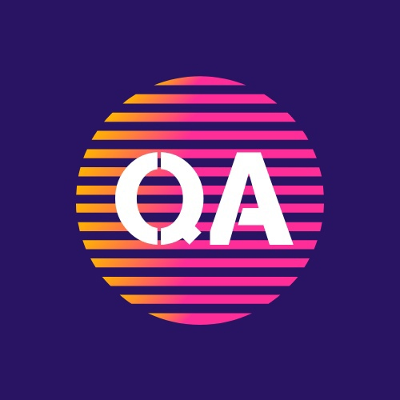

   <h1>
      Hi there!:wave:
   </h1>

## 👦*About me*

+ I'm manual QA Engineer from Novosibirsk
+ Work experience - 1.5 year
+ Now I am developing in autotests
+ **Contacts:**
  + Telegram: [@me4erov](https://t.me/me4erov)
  + Email: armlynskii@gmail.com

## *Additional Education*

<table width="100%" border='0'>
   <tr><td width="30%" height="5%" valign="bottom"></td><td valign="middle">School of manual QA <a target="_blank" href="https://vk.com/qakrotov">QA School</a>.</td></tr>
   
   <tr><td width="30%" valign="bottom"></td><td valign="middle">School of Auto QA <a target="_blank" href="https://qa.guru">qa.guru</a>.</td></tr>
   </tr>
  </table>

## 💻*Stack and tools*
  <code></code>
  <code></code>
  <code></code>
  <code></code>
  <code></code>
  <code></code>
  <code></code>
  <code></code>
  <code></code>
  <code></code>
  <code></code>
  <code></code>
  <code></code>
  <code></code>
  <code></code>
  <code></code>
  <code></code>

## 💾*Projects*

### UI autotests

###  [GitHub Pages](https://github.com/Makaleikin/diploma_ui_tests)

### API autotests
###  [GitHub Pages](https://github.com/Makaleikin/rest_api_diploma)

### Mobile autotests
###  [GitHub Pages](https://github.com/Makaleikin/android_tests_diploma)

## 📊*Git statistic*

